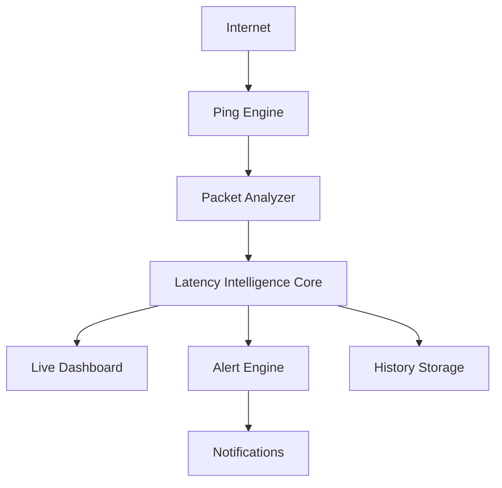

<div align="center">

# ⚡ P I N G • M O N I T O R • X ⚡


### 🌌 The Network Never Sleeps. Neither Do We.

<p align="center">


</p>

<p align="center">


</p>

</div>

---

# 🌐 WHAT IS PING MONITOR X?

Ping Monitor X isn't another ping tool.

It's a **Network Intelligence Dashboard** built to visualize, analyze, and understand the hidden behavior of your connection.

Designed for:

🎮 Competitive Gamers

⚙️ Developers

🌍 Server Administrators

📡 Network Enthusiasts

🚀 Performance Obsessed Users

---

# 🧠 CORE CAPABILITIES

<table>
<tr>
<td width="50%">

## ⚡ LATENCY ENGINE

- Real-Time Ping Tracking
- Adaptive Monitoring
- Millisecond Precision
- Historical Analysis
- Latency Heat Mapping

</td>

<td width="50%">

## 🚨 DETECTION SYSTEM

- Packet Loss Detection
- Disconnect Monitoring
- High Ping Alerts
- Instability Detection
- Smart Warning Engine

</td>
</tr>

<tr>
<td width="50%">

## 📊 ANALYTICS

- Session Reports
- Average Response Time
- Min / Max Ping
- Trend Analysis
- Performance Scoring

</td>

<td width="50%">

## 🎮 GAMING MODE

- Game Server Tracking
- Match Session Monitoring
- Lag Spike Detection
- Competitive Network Analysis
- Live Dashboard

</td>
</tr>
</table>

---

# 🌌 NETWORK STATUS MATRIX

| Indicator | Meaning |
|------------|------------|
| 🟢 | Elite Connection |
| 🔵 | Excellent Connection |
| 🟡 | Stable Connection |
| 🟠 | Unstable Connection |
| 🔴 | Critical Connection |

---

# ⚡ SYSTEM FLOW



---

# 📈 LIVE METRICS

```text
━━━━━━━━━━━━━━━━━━━━━━━━━━━━━━━━━━━━━━

PING            : 24ms

PACKET LOSS     : 0%

JITTER          : 2ms

UPTIME          : 99.99%

NETWORK STATUS  : EXCELLENT

━━━━━━━━━━━━━━━━━━━━━━━━━━━━━━━━━━━━━━
```

---

# 🚀 WHY PING MONITOR X?

Because numbers alone don't solve problems.

Ping Monitor X helps you:

✔ Detect latency spikes

✔ Discover unstable connections

✔ Analyze network performance

✔ Improve gaming experiences

✔ Monitor servers

✔ Understand your network

---

# 📸 SCREENSHOTS

<p align="center">


</p>

---

# ⚙️ INSTALLATION

```bash
git clone https://github.com/devismwanzi502-debug/PingMonitorX.git

cd PingMonitorX

./gradlew assembleRelease
```

---

# 📦 DOWNLOAD

<p align="center">

<a href="#">


</a>

</p>

---

# 🛰️ PERFORMANCE PHILOSOPHY

> Every packet tells a story.
>
> Every millisecond leaves a footprint.
>
> Every connection has a pattern.
>
> Understanding the network is the first step to mastering it.

---

# 🌠 FUTURE ROADMAP

- [x] Live Ping Tracking
- [x] Session Analytics
- [x] Packet Loss Detection
- [x] Alert System
- [ ] AI Latency Predictions
- [ ] Global Monitoring Nodes
- [ ] Cloud Synchronization
- [ ] Advanced Network Diagnostics

---

<div align="center">

# ⚡ POWERED BY DATA ⚡

### 🌌 Observe • Analyze • Optimize 🌌


</div>
C --> D[Live Dashboard]

C --> E[Alert System]

C --> F[History Storage]

E --> G[Notifications]
```

---

# 🎯 USE CASES

### 🎮 Competitive Gaming

Monitor server latency and eliminate surprises during ranked matches.

### 🌍 Server Monitoring

Track uptime and response times of critical services.

### 🏠 Home Networks

Diagnose WiFi and ISP performance issues.

### 💻 Development

Monitor APIs, services, and infrastructure.

---

# 📸 SCREENSHOTS

<p align="center">


</p>

---

# 📥 DOWNLOAD

<p align="center">

<a href="#">


</a>

</p>

---

# ⚙️ INSTALLATION

```bash
git clone https://github.com/YOUR_USERNAME/PingMonitorX.git

cd PingMonitorX

./gradlew assembleRelease
```

---

# 📊 REPOSITORY METRICS

<p align="center">


</p>

---

# 🛰️ PHILOSOPHY

> The network speaks.
>
> We listen.
>
> Every packet tells a story.
>
> Every millisecond matters.

---

<div align="center">

# 🌌 THE FUTURE OF NETWORK MONITORING

### ⭐ STAR THE PROJECT ⭐


</div>
> Measure latency.
>
> Detect problems.
>
> Stay connected.
>
> Optimize your network.

---

# 📥 Download

<p align="center">

<a href="#">


</a>

</p>

---

# 🤝 Contributing

Contributions, bug reports, and feature requests are welcome.

1. Fork the repository
2. Create your feature branch
3. Commit your changes
4. Open a Pull Request

---

<div align="center">

# 🌐 STAY CONNECTED ⚡

### ⭐ Star this repository if you find it useful ⭐

<p align="center">

</p>

</div>
